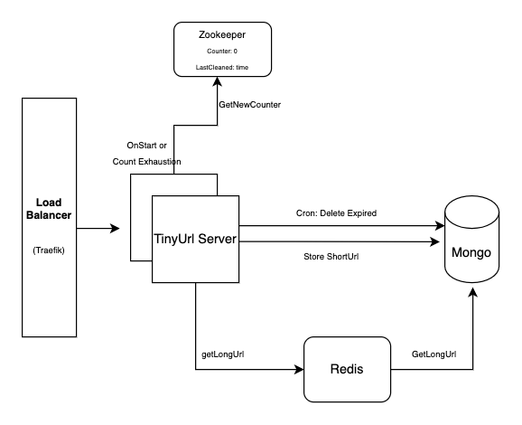

We have integrated
1. Traefik (load balancer)
2. Zookeeper
3. Redis
4. Mongodb
5. Spring Boot server

Description
1. Server has two services
   a. UrlServices -> It generates shortUrl and get LongUrl on shortUrl
   b. Janitor Service -> cron job which delete expired records
2. On Start: server gets distributed lock (using zookeeper) for getting and updating counter in zookeeper
3. Then server will start accepting requests.
4. Get Request returns a redirection status code (302) to "host/get/{longUrl}"
5. before counter exhaustion, server will fetch new counter value from zookeeper asynchronously.
6. Janitor service is a cron job which runs after specified time and delete expired records from cache and mongodb. 

Setup:
In docker-compose.yml
SPRING_SHORTURL_TTL: It's the amount of time in seconds shorturl generated is valid
SPRING_JANITOR_SCHEDULE: (in Second) Cron job scheduling period

To Run:
docker-compose up --build --scale tinyurl=3

Testing:

1. generate short url
2. get long url

curl -X POST -H "Content-Type: application/json" -H Host:server.localhost -d '{"longUrl":"121212"}'  http://server.localhost/generateShortUrl

curl -i -H Host:server.localhost http://server.localhost/c

Traefik Dashboard
http://localhost:22000/dashboard
